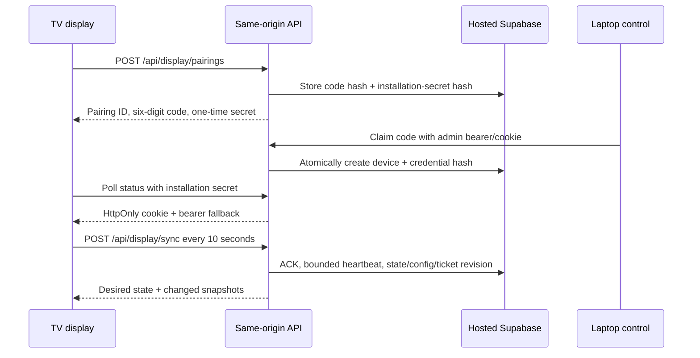

# Operate the display protocol v2 backend

Protocol v2 gives each TV a durable, rotatable installation credential. The TV talks only to same-origin HTTPS endpoints; Supabase Auth, CAPTCHA, Realtime, WebSocket, cookies, and browser storage are no longer required transport dependencies.

This backend is additive. Protocol v1 remains operational until the legacy TV client is retired. The compatible `/display` client is delivered separately.

## Quick rollout path

1. Review `0014_display_protocol_v2.sql` and run the hosted migration dry run.
2. Apply the migration to the linked hosted Supabase project.
3. Deploy the server while leaving the existing protocol v1 enabled.
4. Run the guarded hosted probe against a disposable non-production project.
5. Deploy the protocol-v2 display client and pair one canary TV.
6. Keep protocol v1 available until both TVs have completed a restart test.

```powershell
supabase migration list --linked
supabase db push --linked --dry-run
# Apply only after the reviewed dry run:
supabase db push --linked

pnpm --filter @camtom/server probe:screen-control:hosted
```

Do not use local Supabase or Docker for this project. Do not use `supabase config push` as part of this migration.

## Protocol



### Display endpoints

| Endpoint | Authentication | Result |
|---|---|---|
| `POST /api/display/pairings` | Public, same-origin when `Origin` exists | Five-minute code, pairing ID, installation ID, one-time 256-bit secret |
| `POST /api/display/pairings/:id/status` | Installation secret in `Authorization: Bearer` | Pairing status and short-lived display session |
| `POST /api/display/session` | Installation secret in `Authorization: Bearer` | New 15-minute session after a restart |
| `POST /api/display/sync` | Display cookie or short-lived bearer | State, config, deletion-safe ticket snapshot, ACK and heartbeat |

The client builds its permanent bookmark with a URL fragment. Fragments are not sent to the server. Never put the installation secret in a query string, request path, log, analytics event, or database column.

`sync` returns `nextPollMs: 10000`. Heartbeat timestamps and credential usage are persisted at most once per minute. Ticket rows are returned as a full authoritative snapshot only when `screen_ticket_revision` changes, including after deletions.

### Controller endpoints

| Endpoint | Purpose |
|---|---|
| `POST /api/control/session` | Exchange the existing admin bearer for a 30-day HttpOnly cookie |
| `GET /api/control/session` | Verify the current bearer or cookie |
| `DELETE /api/control/session` | Clear the admin cookie |
| `POST /api/control/display/pairings/claim` | Claim a v2 code |
| `POST /api/control/display/devices/:id/replace` | Claim a code as a safe replacement |
| `POST /api/control/display/devices/:id/rotate` | Revoke the old installation credential and return a new one once |
| `POST /api/control/display/devices/:id/revoke` | Revoke the device and all of its credentials |

Existing admin-bearer endpoints remain compatible. Cookie-authenticated mutations require an exact same-origin `Origin` header. Rotating `CONFIG_ADMIN_TOKEN` automatically invalidates every admin cookie because the token derives the cookie-signing key.

## Security and data ownership

| Data | Storage rule |
|---|---|
| Installation secret | Returned once over HTTPS; never persisted in plaintext |
| Installation credential | Purpose-bound HMAC-SHA256 hash in `screen_device_credentials` |
| Pairing code | Purpose-bound HMAC-SHA256 hash in `screen_pairings` |
| Admin session | Signed `Secure; HttpOnly; SameSite=Strict` cookie |
| Display session | 15-minute signed cookie plus in-memory bearer fallback |
| Supabase service role | Server environment only; never serialized to a client |

Pairing creation is serialized in PostgreSQL. It permits five accepted creations per trusted Vercel IP per 15 minutes, applies a global limit, keeps at most 100 pending requests, and cleans expired pending rows before allocating capacity. Requests without a platform-validated IP remain subject to the global and pending limits.

Team IDs are validated against hosted configuration before claim. Sync reads tickets exclusively for `screen_devices.allowed_team_ids`. Protocol functions and credential tables are service-role-only with RLS enabled and no browser grants.

Every v2 sync revalidates the credential and intersects the device allowlist with the live `app_config` row inside PostgreSQL; it never authorizes from the server's warm config cache. Ticket pages are credential-checked and pinned to that exact config `updated_at`, so a team removal or database failure stops the snapshot instead of retaining stale access.

## Safe replacement

Claiming a replacement creates a new `v2_pending` device but does not revoke the old TV. The first authenticated sync from the replacement atomically:

1. marks the replacement `v2_active`;
2. revokes the old device and its active credential;
3. records `superseded_by` on the old device.

If the new TV never connects, the old TV remains controllable.

## Verification

```powershell
pnpm --filter @camtom/server test
pnpm -r typecheck
pnpm build
git diff --check
```

The hosted probe is opt-in and refuses production. After migration `0014`, it additionally creates a hashed v2 credential and exercises `sync_screen_device_v2`; cleanup still removes the temporary device and cascades its credential.

## Rollback

1. Keep the migration in place. It is additive and protocol v1 remains valid.
2. Roll back the server/client deployment through Vercel CLI.
3. If necessary, set `SCREEN_CONTROL_ENABLED=false` through Vercel CLI and redeploy.
4. Do not drop v2 tables or columns during an incident; retaining them preserves credentials, audit state, and a reversible recovery path.

After rollback, v1 TVs continue to use anonymous Supabase Auth. V2-only installations require the v2 server/client deployment to resume.
