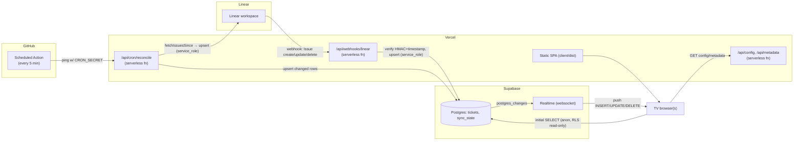

# Plan: Realtime Migration + UI/UX Overhaul

**Status:** proposed (no code written yet)
**Owner:** Camtom
**Date:** 2026-07-14

---

## 1. Objective & locked decisions

The dashboard's realtime pipeline is architecturally void on Vercel serverless: an
in-memory poller (`setTimeout`), an in-memory SSE client list, and a webhook that
broadcasts to that list. On serverless each invocation is an isolated, ephemeral
instance, so webhooks reach an empty client list, the poller never runs on a schedule,
and SSE dies at `maxDuration`. The browser falls back to a 30s poll of a mostly-empty
cache → the "Linear and the web take too long" problem.

**Locked decisions:**

- **State + realtime bus → Supabase** (Postgres as source of truth + Realtime push).
  Free tier, no credit card, 2M realtime messages/month, 200 concurrent connections.
- **Hosting stays 100% Vercel** (static client + stateless serverless API).
- **Linear reads:** webhook is the primary near-instant path; a reconcile job is the
  safety net for missed webhooks. Linear rate limit is 5,000 req/hour — we use <1% of it.
- **No new always-on server, no polling budget to babysit.** Push, not poll.

Rate limit reference: Linear = 5,000 requests/hour + 3,000,000 complexity points/hour per
API key. Current usage after this change: webhook events (dozens/day) + reconcile
(~288/day at 5-min cadence). Massive headroom.

---

## 2. Architecture



### The four data flows

1. **Live push (the fix).** Linear fires a webhook on any Issue change → the Vercel
   function verifies signature + timestamp, computes the timer anchor, and upserts the row
   into Supabase using the **service_role** key. The Postgres change triggers Supabase
   Realtime, which pushes the delta over an existing websocket to every TV **instantly**.
   No polling, no in-memory fan-out.

2. **Initial load.** On mount, the browser does one `SELECT * FROM tickets` via
   `@supabase/supabase-js` with the **anon** key (RLS allows read only). Replaces
   `GET /api/issues`.

3. **Reconcile safety net.** A GitHub Actions scheduled workflow (every 5 min) calls
   `/api/cron/reconcile` with a shared `CRON_SECRET`. The function reads `last_synced_at`
   from `sync_state`, calls `fetchIssuesSince(since)`, upserts any changed rows, and
   advances `last_synced_at`. Catches webhooks that were missed (deploys, downtime).

4. **Config/metadata.** Unchanged. These are already stateless request/response and work
   fine on serverless (they read YAML / hit Linear on demand).

### Why not Vercel Cron
Vercel Hobby cron is limited to **once per day** — too coarse for a reconcile net.
GitHub Actions gives a free 5-min schedule with no credit card. (A once-daily Vercel cron
can still be added as a bonus full-resync.)

---

## 3. Supabase schema

One migration, applied via `supabase db push`. Mirrors the `Issue` shared type; nested
Linear objects are stored as `jsonb` (the UI already treats them as opaque blobs).

```sql
-- supabase/migrations/0001_tickets.sql

create table if not exists public.tickets (
  id             text primary key,          -- Linear issue id
  identifier     text not null,
  title          text not null default '',
  description    text,
  priority       smallint not null default 0,
  priority_label text not null default '',
  created_at     timestamptz not null,
  updated_at     timestamptz not null,
  assigned_at    timestamptz,               -- timer anchor: when 'ticket' label applied
  due_date       timestamptz,
  assignee       jsonb,
  state          jsonb not null default '{}'::jsonb,
  labels         jsonb,
  project        jsonb,
  team           jsonb,
  cycle          jsonb,
  estimate       real,
  synced_at      timestamptz not null default now()
);

create index if not exists tickets_priority_idx on public.tickets (priority);

-- Single-row bookkeeping for the reconcile job
create table if not exists public.sync_state (
  id             int primary key default 1,
  last_synced_at timestamptz,
  constraint sync_state_singleton check (id = 1)
);
insert into public.sync_state (id, last_synced_at)
  values (1, null) on conflict (id) do nothing;

-- Row Level Security: browser (anon) can read tickets; nobody writes via anon.
-- Writes happen only through the service_role key (webhook/reconcile), which bypasses RLS.
alter table public.tickets enable row level security;
create policy "tickets_read_anon" on public.tickets
  for select using (true);

alter table public.sync_state enable row level security;  -- no anon policy = anon cannot touch it

-- Enable Realtime on tickets
alter publication supabase_realtime add table public.tickets;
```

**Notes**
- `assigned_at` replaces the in-memory `LabelTracker` + the `labelTimestamps` SSE payload.
  It becomes a plain column the client reads as `issue.assignedAt`.
- `state`/`assignee`/`labels`/etc. as `jsonb` keeps the client contract identical — no
  shape change on the frontend beyond where data arrives from.

---

## 4. Environment variables

| Variable | Where | Scope | Purpose |
|---|---|---|---|
| `LINEAR_API_KEY` | Vercel | server (existing) | Reconcile + metadata reads |
| `LINEAR_TEAM_ID` | Vercel | server (existing) | Team filter |
| `WEBHOOK_SECRET` | Vercel | server (existing) | Linear HMAC verification |
| `SUPABASE_URL` | Vercel | server (new) | Supabase project URL |
| `SUPABASE_SERVICE_ROLE_KEY` | Vercel | server (new, **secret**) | Webhook/reconcile writes (bypasses RLS) |
| `CRON_SECRET` | Vercel | server (new) | Auth the reconcile endpoint |
| `VITE_SUPABASE_URL` | Vercel | client (new, public) | Browser Supabase client |
| `VITE_SUPABASE_ANON_KEY` | Vercel | client (new, public) | Browser read-only access |

Service role key is **server-only** — it must never appear in a `VITE_` var (those ship to
the browser). The anon key is safe to expose because RLS restricts it to `SELECT`.

Set via CLI:
```bash
vercel env add SUPABASE_URL production
vercel env add SUPABASE_SERVICE_ROLE_KEY production
vercel env add CRON_SECRET production
vercel env add VITE_SUPABASE_URL production
vercel env add VITE_SUPABASE_ANON_KEY production
# repeat for `preview`/`development` as needed; pull locally with `vercel env pull`
```

---

## 5. CLI setup (already installed)

`scoop`, `vercel@56`, `supabase@2.109`, `node@24`, `pnpm@10` are present — nothing to install.

```bash
# Supabase: link the repo to the hosted project and push schema
supabase login
supabase init                       # creates supabase/ (config + migrations)
supabase link --project-ref <ref>   # from the Supabase dashboard URL
supabase db push                    # applies migrations/0001_tickets.sql

# Vercel: link and pull env for local dev
vercel link
vercel env pull .env.local
```

---

## 6. Changes by file

### Delete (dead on serverless)
| File | Reason |
|---|---|
| `server/src/sse.ts` | In-memory SSE fan-out — replaced by Supabase Realtime |
| `server/src/cache.ts` | In-memory cache — replaced by Postgres |
| `server/src/routes/events.ts` | `/api/events` SSE endpoint — gone |
| `server/src/poller.ts` | In-memory poller + LabelTracker — logic moves to reconcile + webhook, anchored in DB |

### Add
| File | Purpose |
|---|---|
| `server/src/supabase.ts` | `createClient` with service_role; `upsertTickets`, `deleteTicket`, `getLastSync`, `setLastSync` |
| `server/src/ticket-mapper.ts` | `linearNode → ticket row` + `webhookData → ticket row` (one mapper, shared) |
| `server/src/routes/reconcile.ts` | `GET /api/cron/reconcile` (CRON_SECRET-guarded) → fetchIssuesSince → upsert |
| `client/src/lib/supabase.ts` | Browser client with anon key |
| `.github/workflows/reconcile.yml` | Scheduled ping every 5 min |
| `supabase/migrations/0001_tickets.sql` | Schema above |

### Modify
| File | Change |
|---|---|
| `server/src/routes/webhooks.ts` | After verify: add `webhookTimestamp` replay check; compute `assigned_at`; upsert/delete in Supabase instead of `handleExternalUpdate` + `sseManager.broadcast` |
| `server/src/routes/issues.ts` | Either delete, or repoint `GET /api/issues` to read Supabase (keep as a fallback for the client's first paint if you don't want the browser holding the anon key — decide in design) |
| `server/src/app.ts` | Remove `startPolling()`, remove webhook auto-register-on-boot (move registration to a one-off script/CLI), keep route mounting |
| `client/src/hooks/useIssues.ts` | Replace EventSource+poll with: initial `select`, then `supabase.channel('tickets').on('postgres_changes', …)`; map row→`Issue`; keep the id-`Map` merge + sort; wire `error` state |
| `shared/src/types.ts` | Add a `TicketRow` type (snake_case DB shape) or a mapper; drop `SSEDelta` if unused |
| `vercel.json` | Drop the SSE-oriented bits; optionally add a daily Vercel cron for full resync; keep `includeFiles: config/**` |

### Webhook registration
Today `app.ts` auto-registers the webhook on every cold start. Move it to a one-shot:
`pnpm --filter server exec tsx scripts/register-webhook.ts` (or a tiny `vercel` build hook)
run once manually. Re-registering on every invocation is wasteful and racy.

---

## 7. Work phases (task checklist)

### Phase 0 — Realtime (the 80%) — do first, ship, verify
- [ ] Create Supabase project; `supabase init` + `link` + write migration + `db push`
- [ ] Add `server/src/supabase.ts` + `ticket-mapper.ts`
- [ ] Rewrite `routes/webhooks.ts`: verify HMAC + `webhookTimestamp` (reject > 60s) → upsert/delete
- [ ] Add `routes/reconcile.ts` + `sync_state` read/write
- [ ] Add `.github/workflows/reconcile.yml` (5-min schedule, `CRON_SECRET` header)
- [ ] Add `client/src/lib/supabase.ts`; rewrite `useIssues.ts` to subscribe
- [ ] Delete `sse.ts`, `cache.ts`, `routes/events.ts`, `poller.ts`
- [ ] Set all env vars in Vercel (§4); one-shot webhook registration
- [ ] **Verify:** create a ticket in Linear, watch it appear on the dashboard in < 2s

### Phase 1 — TV legibility + broken-rule cleanup
- [ ] Replace the 4 emoji/glyphs with existing SVGs (`🔥`→`IconFire` `SLATimer.tsx:263`; `✓`→`IconCheck`; `+`)
- [ ] Fix the SLA ring math (compute circumference from the actual drawn `r`, `SLATimer.tsx:13,172`)
- [ ] Bump timer/label font sizes for across-the-room legibility (`SLATimer.tsx:147,254,271`)
- [ ] Solve the horizontal scroll on 1080p (responsive columns / honor `columnVisibility`)
- [ ] Wire the 3 dead settings (`pollingInterval` moot now, `columnVisibility`, `autoMute`) or remove them
- [ ] Swap medium-priority blue `#3B82F6` for a warm on-theme color

### Phase 2 — Quality / reuse
- [ ] `client/src/lib/priorities.ts` as the single source for priority label/color/order (dedupe 6 files)
- [ ] `usePersistentState` hook (collapse 6 localStorage copy-pastes)
- [ ] `<Button>` / `<Badge>` atoms (remove ~15 inline hover handlers; fixes keyboard focus)
- [ ] Split `SettingsPanel.tsx` (990 lines) per tab; share one `SettingsOverrides` type + merge fn
- [ ] Delete dead code (`IconStopwatch`, `formatDuration`/`formatDate`, unused CSS/vars)

### Phase 3 — Robustness
- [ ] Visible error state on the board (today a Linear failure shows silent empty)
- [ ] Harden the Friday report metric (don't use `updatedAt` as resolution time)
- [ ] a11y pass: modal focus trap + Escape, keyboard nav on filter multiselect

---

## 8. Rollout & rollback

1. Build Phase 0 on a branch; deploy to a **Vercel preview** with its own Supabase project
   (or a `preview` schema).
2. Point a **second** Linear webhook at the preview URL (Linear allows multiple webhooks) so
   prod keeps working untouched during testing.
3. Verify create/update/delete + reconcile on preview.
4. Promote to production; update the prod webhook URL; set prod env vars.
5. **Rollback:** the old code path is in git history; redeploy the previous production
   deployment from the Vercel dashboard (instant). Supabase tables are additive — leaving
   them in place costs nothing.

---

## 9. Verification (evidence, not assertions)

- **Latency:** create a Linear ticket, screen-record the dashboard; confirm < 2s to appear.
- **Missed-webhook recovery:** disable the webhook, change a ticket, confirm the 5-min
  reconcile brings it in.
- **RLS:** attempt an `INSERT` with the anon key from the browser console → must be denied.
- **Replay protection:** replay a captured webhook with an old timestamp → 401.
- **Rate limit:** check `/api/health` rate-limit headers stay well above zero over a day.
- **No horizontal scroll** at 1920×1080; timer readable from ~3m.

---

## 10. Risks & mitigations

| Risk | Mitigation |
|---|---|
| Supabase free project pauses after 7 days idle | Always-on TV keeps it active; long shutdown → one-click unpause |
| GitHub Actions schedule drift / 60-day disable | Webhook is primary; reconcile is only a net. Daily Vercel cron as extra backup |
| Anon key abuse | RLS = read-only; no write path via anon; service role stays server-side |
| Webhook lost during a deploy | Reconcile backfills within 5 min |
| `assigned_at` (timer anchor) wrong after cold migration | Reconcile stamps `assigned_at = updated_at` for already-labeled issues on first full sync, matching current `stampKnown` behavior |
```
