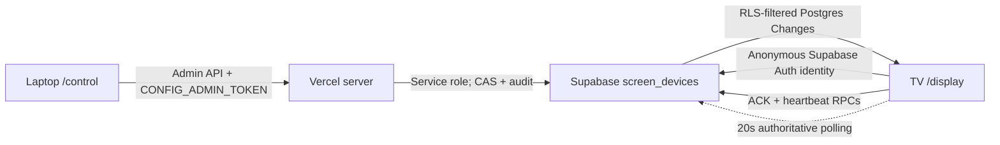

# Universal browser screen control

> **Protocol v2 transition:** the additive server protocol that removes CAPTCHA, Supabase Auth, storage, and WebSocket requirements from TVs is documented in [display-protocol-v2-backend.md](display-protocol-v2-backend.md). This document describes the still-supported protocol v1 client and its rollback path.

This feature controls **application state inside the Camtom dashboard**. It is independent of TV brand and operating system because the only TV requirement is a browser capable of loading the site. It does not control power, hardware volume, browser tabs, HDMI inputs, or operating-system settings.

## Architecture

- `screen_devices.desired_state` plus `state_version` is the source of truth.
- Realtime reduces latency. It is not authoritative: reconnect and periodic polling always re-read the device row.
- The TV ignores out-of-order versions, validates both panes against `allowed_team_ids`, applies the state, then ACKs the applied version.
- The same 20-second authoritative read also performs a serialized, version-aware effective-config refresh, so team/SLA/config changes converge even when `state_version` does not change. Realtime and polling refreshes share one in-flight request to avoid a reconnect stampede.
- Heartbeats are durable. `last_seen_at`, desired/applied versions, and capability detection produce `online`, `unstable`, `offline`, or `stale` status.
- The controller uses the existing `CONFIG_ADMIN_TOKEN` from `sessionStorage`. No service-role credential reaches the browser. The API boundary can later replace this middleware with permanent user auth without changing the device protocol.

## Required environment names

Do not put values in documentation or source control.

- `SCREEN_PAIRING_SECRET` — dedicated random secret of at least 32 characters. It is not `CONFIG_ADMIN_TOKEN`.
- `SCREEN_CONTROL_ENABLED` — defaults to disabled unless exactly `true`.
- `SCREEN_REQUIRE_PAIRING` — defaults to disabled unless exactly `true`.
- `SCREEN_CAPTCHA_PROVIDER` — set to `turnstile` only after the hosted provider is ready.
- `SCREEN_CAPTCHA_SITE_KEY` — public Cloudflare Turnstile site key used by TV browsers. Never place the Turnstile secret here.
- Existing server credentials: `CONFIG_ADMIN_TOKEN`, `SUPABASE_URL`, `SUPABASE_SERVICE_ROLE_KEY`.
- Existing browser credentials: `VITE_SUPABASE_URL`, `VITE_SUPABASE_ANON_KEY`.

## Hosted Supabase setup

The repository deliberately keeps `enable_anonymous_sign_ins = false` in `supabase/config.toml`. Anonymous sign-ins are a gated hosted rollout action, not a safe repository default. `supabase config push` mutates the project's full configuration surface; do not use it for this setting without separate production approval and a reviewed configuration diff.

For an approved rollout:

1. Use Supabase CLI against the linked **hosted** project; do not start or reset a local project.
2. Review and apply migration `0012_screen_remote_control.sql` through the normal hosted migration gate.
3. Create a Cloudflare Turnstile site for the deployed dashboard origins. Configure `SCREEN_CAPTCHA_PROVIDER=turnstile` and the public `SCREEN_CAPTCHA_SITE_KEY` with Vercel CLI, then deploy with screen control still disabled. Never print secret values into logs.
4. In the Supabase Dashboard open **Authentication > Bot and Abuse Protection**, enable CAPTCHA protection, select Cloudflare Turnstile, and enter the Turnstile **secret key** there. The secret belongs only in hosted Supabase Auth; it is not a Vercel environment variable.
5. In a disposable non-production project, enable anonymous sign-ins, confirm the Auth platform rate limit, verify `screen_devices` Realtime publication membership, and run the guarded integration probe.
6. Enable hosted production anonymous sign-ins only after the same CAPTCHA configuration is verified. Treat any CLI configuration push as a full-config mutation.

Migration `0012` is additive. It creates device, one-time pairing, command audit, and rate-attempt tables; fail-closed RLS; auth-UID-bound ACK/heartbeat RPCs; Realtime publication membership; and bounded cleanup. The service-role-only hourly cleanup reports deletion counts and removes at most 100 anonymous Auth users per run, only after 30 days and only when they own no screen device and have no active pending pairing. Authenticated TVs can read tickets only for their device `allowed_team_ids`. Legacy unauthenticated dashboards retain the existing configured-team policy during transition.

## Safe rollout

1. Deploy code and database support with both feature flags false.
2. Configure `SCREEN_PAIRING_SECRET`, Turnstile site key/provider in Vercel, and Turnstile secret/provider in hosted Supabase Auth; then verify CAPTCHA on non-production.
3. Enable hosted anonymous Auth only after CAPTCHA is active. Set `SCREEN_CONTROL_ENABLED=true` and keep `SCREEN_REQUIRE_PAIRING=false`. The legacy root URL remains local; use `/display` to pair each TV deliberately.
4. On each TV open `/display`. It creates an anonymous identity and shows a six-digit code valid for five minutes.
5. On the laptop open `/control`, enter the existing admin token, then claim the code, name the TV, and choose its allowed teams.
6. Verify heartbeats, ACK version, ticket scope, Realtime recovery, and polling diagnostics for both TVs.
7. Only after every installed display is paired, optionally set `SCREEN_REQUIRE_PAIRING=true` so the root route also requires pairing when screen control is enabled.

Six-digit codes are deterministic only for an idempotent start request, collision-checked, HMAC-hashed with `SCREEN_PAIRING_SECRET`, one-time, and never stored as plaintext in Supabase. Starting pairing creates only an expiring pending row; the permanent device is allocated atomically on successful admin claim. Durable limits combine anonymous UID, a HMAC bucket for a validated platform-owned IP when available, and a conservative global window. Only accepted attempts consume each rolling quota, so rejected traffic cannot extend an outage; rejected attempts are still retained separately in the audit table until bounded cleanup. When a trusted platform IP is unavailable, UID plus global limits remain mandatory; arbitrary forwarded headers are never trusted.

New TV identities request a Turnstile token and pass it to `signInAnonymously` as `captchaToken`. Pairing fails closed with an explicit configuration diagnostic when CAPTCHA is missing. In production, screen control also refuses to create a new anonymous identity without the Turnstile provider and public site key, even when root-route pairing is not required. Once CAPTCHA is correctly configured, an existing anonymous session does not solve another challenge until its identity must be recreated.

## Operating the controller

- Each card shows durable connectivity and desired/applied versions.
- Configure single or vertical split layout, team per pane, board/report view, text and priority filters, and app mute.
- **Apply** uses an expected-version compare-and-swap and an idempotent request ID.
- **Apply to TV1 and TV2** sends one independently audited command to each of the first two active screens. It is intentionally not a cross-device transaction.
- **Prepare internal reload** changes a nonce so React remounts the dashboard. It does not reload or control the browser process.
- **Revoke / re-pair** immediately removes ticket access. The TV then generates a new one-time code.

## Recovery and diagnostics

- **Realtime unavailable:** the TV continues authoritative polling every 20 seconds. No WebSocket support is required.
- **Runtime kill switch:** an open paired display re-reads `/api/screens/features` every 30 seconds. When `SCREEN_CONTROL_ENABLED` becomes false, it tears down Realtime, polling, and heartbeat transport and renders the local dashboard without deleting its browser identity or pairing. Controller claim/state/revoke mutations fail closed while the flag is off. Re-enabling the flag restarts discovery and resumes the existing pairing unless it was revoked.
- **Storage cleared:** the browser loses its anonymous identity, cannot see the old device row, and starts a new pairing. Revoke the abandoned device from `/control`.
- **CAPTCHA unavailable or misconfigured:** no anonymous TV identity or pairing request is created; the display shows the server diagnostic. Verify the Turnstile site origin, the two Vercel environment names, and hosted Supabase Bot and Abuse Protection.
- **Revoked device:** RLS immediately removes ticket access; the TV shows a re-pair action.
- **Stale command:** the TV ignores versions not greater than the last applied version.
- **Invalid or out-of-scope state:** the TV does not apply or ACK it and shows a diagnostic error.
- **Old TV browser:** CSS uses `100vh` before the `100dvh` enhancement; WebSocket is capability-detected.

## Non-production hosted integration probe

`pnpm --filter @camtom/server probe:screen-control:hosted` validates auth-UID RLS isolation, Realtime delivery, CAS/idempotency, and authenticated ACK against a hosted project. It uses service-role-created synthetic users and admin-generated, single-use magic-link tokens to obtain temporary sessions without consuming interactive CAPTCHA challenges. It does **not** test anonymous Auth, Turnstile, or the browser pairing UX. It is opt-in and performs temporary writes, so it is never part of the default test suite.

The probe refuses to start unless all guard environment names are present: `SCREEN_CONTROL_INTEGRATION`, `SUPABASE_PROJECT_REF`, `SCREEN_CONTROL_TEST_PROJECT_REF`, `SUPABASE_PRODUCTION_PROJECT_REF`, and `SCREEN_CONTROL_INTEGRATION_CONFIRM`, plus the exact server-side hosted credentials `SUPABASE_URL`, `SUPABASE_ANON_KEY`, and `SUPABASE_SERVICE_ROLE_KEY`. `SUPABASE_ANON_KEY` is the Node probe variable; `VITE_SUPABASE_ANON_KEY` is the browser build variable and is not a substitute. The URL ref, selected ref, and test ref must match; the production ref must differ; and the confirmation must explicitly name the non-production ref. It enters failure-safe cleanup before creating the first synthetic user, registers each temporary user, channel, and device immediately, and exits nonzero if any channel, device, or Auth-user cleanup fails. Run it only after migration `0012` is ready in a disposable staging project. It was not executed as part of this implementation.

## Manual browser CAPTCHA and pairing E2E

Turnstile tokens are interactive, origin-bound, short-lived, and single-use, so the automated hosted probe intentionally cannot prove this flow. Before enabling production pairing, perform this checklist against the deployed non-production site:

1. Confirm the browser origin is allowed by the Cloudflare Turnstile site and hosted Supabase Auth has Turnstile CAPTCHA protection enabled.
2. Confirm Vercel exposes `SCREEN_CAPTCHA_PROVIDER=turnstile` and the matching public `SCREEN_CAPTCHA_SITE_KEY`; keep both screen feature flags disabled until this check passes.
3. In a fresh private browser profile with no Supabase session, open `/display` and verify Turnstile completes without exposing its token in the URL, UI, console, or network logs.
4. In Supabase Auth logs, verify exactly one successful anonymous sign-in. Confirm the TV receives an anonymous session and displays one six-digit pairing code.
5. From `/control`, claim the code once. Verify replaying the same code fails and the TV transitions to the configured team state.
6. Confirm the created `screen_devices.auth_user_id` matches the anonymous Auth user, RLS limits tickets to `allowed_team_ids`, Realtime applies a new state, polling recovers after a reconnect, and ACK/heartbeat advance.
7. Clear the TV browser storage and repeat once. Verify a new Turnstile challenge and anonymous identity are required, then revoke the abandoned device and remove any abandoned pending pairing.
8. Temporarily remove the CAPTCHA site key in non-production and verify `/display` fails closed with the configuration diagnostic and creates no Auth user or pairing row. Restore the reviewed setting afterward.

## Rollback

Set `SCREEN_REQUIRE_PAIRING=false`, then `SCREEN_CONTROL_ENABLED=false` with Vercel CLI and redeploy through the normal gate. Root and `/display` return to local dashboard state. Do not drop the Phase 3 tables during an incident; retaining them preserves audit and makes rollback reversible. Disabling anonymous sign-ins is safe only after no displays depend on their sessions.
